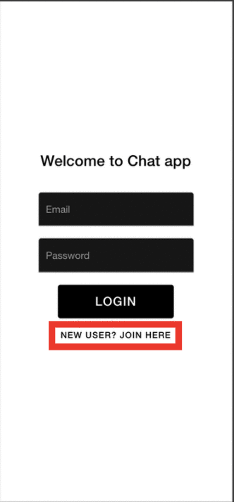

# _**COSC481W Group 4 Project Report:** 'Chat App'_
1. [Group Information](#1-group-information)
2. [Introduction](#2-introduction)
3. [User Manual](#3-user-manual)
4. [Implementation Manual](#4-implementation-manual)
    1. Conceptual Design
    2. Functional Requirements
    3. [System Requirements](#3-system-requirements)
    4. [Implementation Plan](#4-implementation-plan)
    5. Application Programs
        1. [Create React Native Environment](#i-create-react-native-environment)
        2. [Download Source Code](#ii-how-to-download-chat-app-source-code-from-github)
        3. [Connect App to Firebase](#iii-how-to-connect-chat-app-to-google-firebase)
        4. [Install Node Modules](#iv-how-to-install-node-modules)
        5. [Run App](#v-how-to-run-chat-app)
    6. Descriptiion of Programs
## **_1. Group Information_**

## **_2. Introduction_**


## **_3. User Manual_**
The instructions of how to use ‘Chat App’ are listed below according to action. 

| Task | Instructions | Example|
|---|---|---|
| Sign Up |   1. Select ‘New user? Join here’</br> 2. Enter your first name, last name, email and a six character password </br>3. Press ‘Sign Up’|  |
| Log In | 1. Enter the email and six character password you created at sign up</br> 2. Press ‘Login’ |  |
| Sign Out | 1.Go to ‘Your Profile’ from Navigation Drawer</br>2. Press ‘Sign Out’ |  |
| Navigation |  1. Press the hamburger button </br> on the upper left corner | |
| View Profile | 1. Open Navigation Drawer</br>2. Press ‘Your Profile’ |  |
| Edit profile | 1. Open Navigation Drawer</br>2. Press ‘Your Profile’ </br>3. Select ‘Edit Profile’ </br> 4. Enter changes to bio</br>*Image upload not functional</br> Press 'Submit Changes'| |
| View Account Details | 1. Open Navigation Drawer</br>2. Press ‘Your Profile’</br> 3. Press ‘View Account Details’ |  | 
| Add Contact | 1. Open Navigation Drawer</br> 2. Press ‘Search’</br> 3. (Optional) Search by name (Accounts not already in contacts)</br> 4. View Profile on click</br> 5. Add contact from profile | |
| View Contacts | 1. Open Navigation Drawer</br> 2. Press ‘Contacts' ||
| New Conversation | 1. Open Navigation Drawer</br> 2. Press ‘Home’</br> 3. Select Chat Bubble Icon in upper right corner</br> 4. (Optional) Use the search bar to enter the name of the user you are looking for</br> 5. Select a name to add them to the conversation</br> 6. (Optional) Select the name of the user from the list above the search bar to remove them from the list</br> 7. Select ‘Chat Now!’||
|Send Message | 1. Open Navigation Drawer</br> 2. Press ‘Home'</br> 3. Select the Conversation you'd like to send a message in</br> 4. Start typing and press ‘Send’</br> 5. See sent/received messages on screen |  |
|Conversation Menu | 1. Open Navigation Drawer</br> 2. Press ‘Home’</br> 3. Select Conversation you'd like to enter</br> 4. Select the hamburger icon in the upper right corner</br> 5. (Optional) View chat member profile by pressing their name</br> 6. (Optional) Add members who are not already contacts from their profile</br> 7. View Chat Members| |
    
[Back to Top](#cosc481w-group-4-project-report-chat-app)


# **_4. Implementation Manual_**
...
## **_3. System Requirements_**

The system requirements of ‘Chat App’ are listed below according to the function category.

**User Authentication**

_Sign Up_

Users will enter their first and last name, email and password on the sign up screen. Once an account is created through Google Firebase Functions an Account and Profile objects will be created and stored in Google Firebase Firestore. The Account object holds the Profile object and is then stored in a collection called, ‘ACCOUNTS’ in Google Firestore according to the UID generated by Google Firebase Authentication at Sign Up. The user is then directed out of the Authentication Stack and to the home screen of the app.

_Login_

Users will enter their email and password for the account they created at sign up. After a successful login the user is directed out of the  Authentication Stack and to the home screen of the app.

_Sign Out_

Users will press the sign out button from their Profile screen which will sign them out using Google Firebase Authentication functions. They will no longer have access to the App Stack and be moved into the Authentication stack. 

_Error Catching_

If login or sign up is unsuccessful the methods will return error messages which are displayed on screen. 

**Account/Profile Management**

_Profile View_

When the users navigate to the ‘You Profile’ screen via the Navigation Drawer the data stored according to their UID in the ACCOUNTS collection on Google Firestore is pulled, specifically the Profile object which holds their name and bio. That data is then displayed on screen.

_Profile Edit_

The user can navigate to the Edit Profile page where they can type a new bio and press submit changes to update the value stored in their Account object which is stored in Google Firestore ACCOUNTS collection.

_Account Details View_

When the user navigates to view their account details data is pulled from their Account object stored in Google Firestore ACCOUNTS collection including name, email, account creation date and time, profile, conversations and contacts. The data is displayed on screen. 

**Contacts Management**

_Contacts List_

When a user navigates to Contacts List from the Navigation Drawer their Accounts stored in Google Firestore ACCOUNTS collection is pulled. The CONTACTS array containing the UID’s of all their contacts in the Account object then mapped to pull profile information from the ACCOUNTS collection. The data is then sent to a list for viewing. 

_Search Contacts_

The Users can navigate to the search screen which will pull the name and UID of all the Account objects listed in the Google Firestore ACCOUNTS collection. The accounts pulled are that of all UIDs not existing in the current user’s contacts list. The data is then displayed in a list for viewing. 

**Conversations Management**

_Conversations View_

When the user enters their home screen their Accounts stored in Google Firestore ACCOUNTS collection is pulled, specifically the CONVERSATIONS array. This array contains objects which store a CID, conversation ID, and UNREADMESSAGES, which is the number of unread messages the current user has for this conversation. The CID’s are then mapped to pull the data stored by CID in the CONVERSATIONS collection stored in Google Firestore. Each conversation object’s data is pushed to the app for viewing. 

_Conversation Details_

When in a conversation the user can view the conversation’s members. The data is pulled by the conversations CID from the CONVERSATIONS collection in Google Firestore.  The USERS array containing the UID’s of all users in the conversation is pulled and mapped to get the profile data of each user from the Account object stored by UID in the ACCOUNTS collection. The data is then shown in a list on screen. 

_Conversations Notifications_

When the user enters their home screen their Accounts stored in Google Firestore ACCOUNTS collection is pulled, specifically the CONVERSATIONS array. This array contains objects which store a CID, conversation ID, and UNREADMESSAGES, which is the number of unread messages the current user has for this conversation. If the user’s UNREAD MESSAGES is greater than 0 then the row containing the conversation’s information is bolded. The app constantly listens for changes. 

_Conversations Create_

The users can create a new conversation from the New Chat screen. This screen renders a list of the users contacts by pulling the array of UID’s titled CONTACTS from the users’ Account object stored in the ACCOUNTS collection of Google Firestore and mapping them to listable objects for on screen viewing. 

**Message Management**

_Message Create_

The user can type in their message once they enter a conversation and press send. The details of that message are stored in a Message object which is added to the Conversation’s object stored by CID in the CONVERSATIONS collection in Google Firestore. The message’s text content is set as the LASTMESSAGE and the message’s time is set as the LASTEDITED value for the Conversation object. The members of the conversation will have snapshots triggered when the message is sent which will bolden the conversations row on the Home screen and show the message’s text content and time. 

**Navigation**

_Navigation Drawer_

Users can access the various Navigations stack from the Navigation drawer. 

[Back to Top](#cosc481w-group-4-project-report-chat-app)

## **_4. Implementation Plan_**
Below are the functions and features of ‘Chat App’ listed by who implemented them into the system.

 **Sign Up**
 
_Google Firebase Authentication_

<ins>Ben Bruursems:</ins> Email/6 character password using Firebase Authentication functions

<ins>Morgan Iverson: </ins> First/Last Name entry, Display of Sign Up Errors, Account/Profile Creation and Storage in Firebase Firestore

 **Log In**
 
_Google Firebase Authentication_

<ins>Ben Bruursems:</ins>  Email/Password login using  Firebase Authentication functions

<ins>Morgan Iverson:</ins> Display Login Errors

 **Conversation/Chat**
 
_React Native & Firebase Firestore_

<ins>Morgan Iverson:</ins> Show Current Users Conversations, Open Conversation Chatroom and stored messages on click, Bold Unread messages, Listen for new Conversations and Bold, Start New Conversation from User Contact List, Chat Menu, Send/Receive/Store Messages 

 **Navigation**
 
 _React Native Drawer Navigation_

<ins>Morgan Iverson:</ins> Basic Drawer Navigator, Various Stack Navigators, Home, Contact List, Chat Room, Conversations, Profile, Account Details, Edit Profile and Search Screens

 **Profile**
 
_React Native & Firebase Firestore_

<ins>Morgan Iverson:</ins> Display User Name and Bio, Edit Profile, View Account Details

 **Contacts**
 
_React Native & Firebase Firestore_

<ins>Morgan Iverson:</ins> Load User Contacts, View Contact Profile, Search App Users, Add Contacts from Search

 **Sign Out**
 
_Google Firebase Authentication_

<ins>Ben Bruursems:</ins> Sign Out current user using  Firebase Authentication functions

 **UX Styles**
 
_AdobeXD_

<ins>Yaneli Sanchez:</ins>  [AdobeXD UI Design](https://xd.adobe.com/view/4c2876a7-9336-45db-8ff7-44ac0d75146d-197b/)

**Project Report**

_User Manual_

<ins>Morgan Iverson:</ins> Sample Outputs and User Instructions

_Implementation Manual_

<ins>Ben Bruursema:</ins> Firebase Connection

<ins>Yhayh Thabet:</ins> Functional Requirements

<ins>Morgan Iverson:</ins> System Requirements, Conceptual Design, Implementation Plan, Node Modules, Github Download, Code Listing, React Native Environment Set Up


[Back to Top](#cosc481w-group-4-project-report-chat-app)

## **_5. Application programs_**
This document lists instructions for setting up the development environment to edit and run ‘Chat App’.

### **_i.Create React Native Environment_**
These are instructions on how to create an environment to run a React Native App.

1. Ensure you have NodeJS installed [Installation Guide Here](https://www.tutorialspoint.com/nodejs/nodejs_environment_setup.htm)
2. Go to Terminal
3. Install create-react-native-app
```npm install -g create-react-native-app```

4. cd to where you want your app to be
5. Create your project by entering the following line in Terminal

```create-react-native-app MyProjectName```


### **_ii. How to download ‘Chat App’ source code from Github_**
Below is a link to download a zip file containing the ‘Chat App’ source code from the main branch: 
[https://github.com/ysanche1/COSC481W-Group4/archive/refs/heads/main.zip](https://github.com/ysanche1/COSC481W-Group4/archive/refs/heads/main.zip)

These are instructions on how to add files to your React Native App.

1. Copy the unzipped files (‘_src’ folder and‘package.json’ file) into your project folder (where App.js is located)
2. Open App.js
3. Replace the entire contents of the file with the following code

```
import { StatusBar } from 'expo-status-bar';
import React from 'react';
import Providers from './_src/navigation/index.js';

export default function App() {
  return (<Providers/>);
}
```


### **_iii. How connect ‘Chat App’ to Google Firebase_**
These are instructions on how to permit access of your App to Google Firebase features including, Authentication and Firestore.
 1. 


### **_iv. How to Install Node Modules_**
These are instructions on how to install the Node Modules required to run ‘Chat App’.

**Option 1:**
1. Ensure you have Node or Yarn installed on your computer
2. Ensure the ‘package.json’ file copied from Github is in the same folder as App.js
3. Enter Terminal 
4. cd into the project folder (where App.js)
5. Run the following command in terminal
```npm install```

**Option 2:**
1. Ensure you have Node or Yarn installed on your computer
2. Ensure the ‘package.json’ file copied from Github is in the same folder as App.js
3. Enter Terminal 
4. cd into the project folder (where App.js)
5. Run the following command in terminal where <package-name> is the name of the module(s) to be installed
```
npm install <package-name> <package-name> <package-name>
```

This is a listing of the node modules and their source. 


### **_v. How to run ‘Chat App’_**
These are instructions on how to run ‘Chat App’ from terminal.

1. Ensure you have the node module ‘expo’ installed
2. Enter Terminal 
3. cd into the project folder (where App.js)
4. Enter the following line into terminal
```expo start```

[Back to Top](#cosc481w-group-4-project-report-chat-app)
